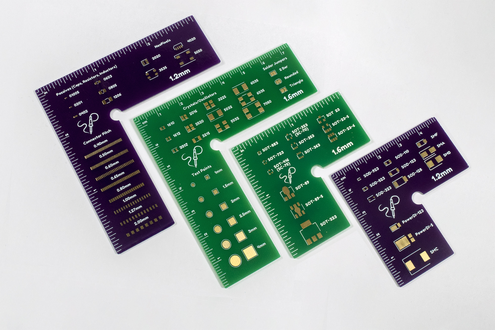

# PCB Holder / Ruler

This is a collection of two-in-one rulers with KiCad footprint references and pcb holders for solder paste stenciling.

The rulers are in centimeters on one side, and inches on the other side. The footprints are the same on both sides.

The cutouts in the inner corners allow you to easily remove a square PCB after applying paste.

# Sizes
The rulers/holders come in two sizes and each size comes in 1.2mm and 1.6mm thickness options.

The smaller size is 5x5cm, with 2.5cm inner cutout. You can use four of these to encapsule a 5x5cm PCB.

The larger size is 7.5x7.5cm, with 5cm inner cutout. You can use four of these to encapsule a 10x10cm PCB.

The green rulers/holders are 1.6mm thick, the purple ones are 1.2mm thick.

# Footprints
Each of the four size/thickness combos has different footprints:

- small 1.6mm: different sizes of SOT packages
- large 1.6mm: crystals/oscillators, solder jumpers, and test points
- small 1.2mm: different sizes of diodes, including SOD, SMX, and PowerDI
- large 1.2mm: passives (capacitors, resistors, inductors), NeoPixels, and connector pitches

# Links

You can buy these from: https://lectronz.com/products/pcb-holder-ruler